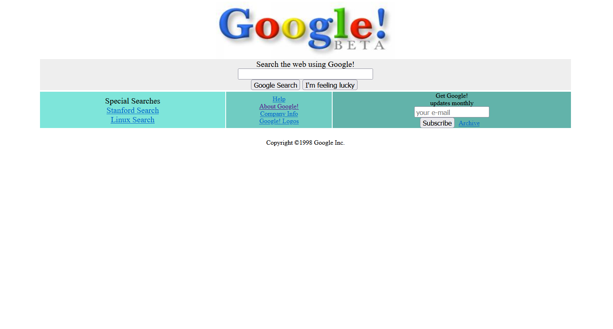

# GOOGLE BETA TASARIMI ÖDEVİ
Google 1996 yılında kuruldu ve ilk versiyonunu 1998 yılında yayınladı. 1998, çok uzun bir süre önce değil mi? İlk versiyonu ile şu anki versiyonu arasında büyük fark var tabii ki. Peki size Google'un ilk versiyonunu gösterebileceğimizi söylesek ne hissederdiniz?

İnternetteki gelmiş geçmiş bütün web sitelerini görebileceğiniz Wayback Machine adında bir web arşivi bulunmakta. [Google 1998](https://web.archive.org/web/19981202230410if_/http:/www.google.com/) linkinden Google'ın ilk versiyonu nasılmış görebilirsiniz.

Bizde bu ödevde Google'ın ilk versiyonunu HTML5 vs CSS3 kullanarak tasarlıyoruz.

## GOOGLE BETA

