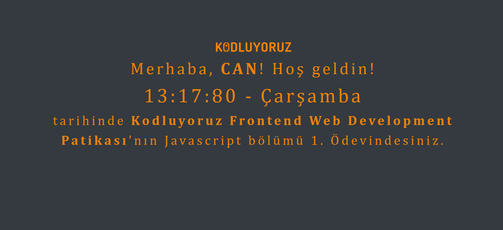

# Javascript Saat ve Karşılama
Kodluyoruz 5. Hafta ödevi olarak JavaScript saat ve karşılama ödevi yaptım.

Çalışma mantığı şu şekilde :

Siteye giriş yapan kişinin adını alıp ekrana yazdıran ve o anki saati kullanıcıya gösteriyor.

## Görünüm

